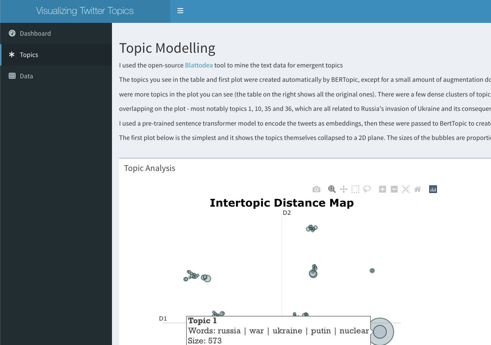
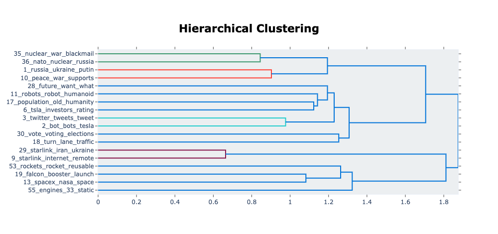
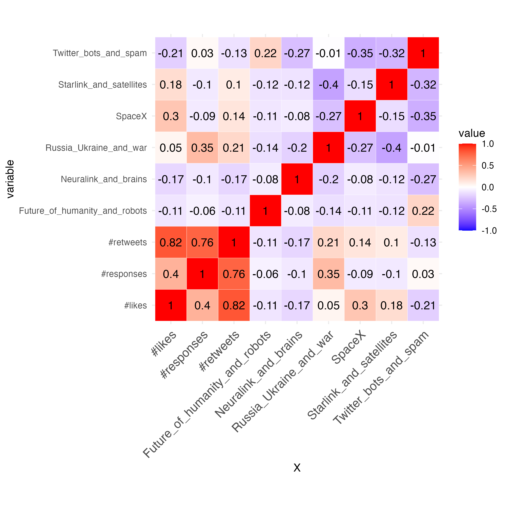

## Using OSINT tools and Transformers to extract topics and sentiment
Using the Blattodea tool that I helped develop during a hackathon, I retrieved the most recent tweets from Elon Musk. I then used one of [HuggingFace's](https://huggingface.co/models) pre-trained sentiment classification models and [BERTopic](https://maartengr.github.io/BERTopic/index.html) to extract and visualize key themes.
I have also developed an RShiny dashboard for this project to hone my interactive visualization skills. 

## Note on utility and future projects
BERTopic can accommodate ["online topic modelling"](https://maartengr.github.io/BERTopic/getting_started/online/online.html) (i.e. incrementally adjusts topics with new data), and the results in this project have shown the model to be qualitatively coherent (lacking a labelled dataset, I am unable to compute the exact accuracy of clustering/classification). It would not be difficult to expand this work to a more regular, (semi-)automated pipeline to *monitor social media content* around a particular hashtag/person/theme and to extract insight or detect sudden changes. Suppose you were a news organisation looking to gauge interest in a particular recent event. Although social media isn't representative of general discourse around any given topic, taking data from Twitter, passing it through BERTopic and then setting the pipeline to regularly update the data and topics, would give you the data to assess at least some of the discussion around a theme or event. 

## Results and thoughts
(Results are analysed and visualized at greater length inside the repo's index.Rmarkdown notebook. For cleaning, EDA and modelling code, please see the Jupyter notebooks in the repo, explained in the filing system below)

### Overall usage
I have been able to extract clear and definite topics from the collected data, and the pattern of activity around key themes has been what I expected it to be. For example, Musk's opining on ending the war in Ukraine generated a larger amount of responses across the board than his other tweets. Through this project I've found that BERTopic has been extremely useful and capable of extracting information from unstructured text data, and I plan on using it in future projects. Moreover, the model was able to group topic clusters at a greater level of precision and accuracy than I had honestly expected. In the dendrogram included below I show how some of the topics (the most interesting ones) have been grouped by the model and what the model tells us vs what we can infer. For an NLP project is arguably even more important than in most data science projects to combine contextual knowledge and data viz with the results: language is far more ambiguous and mysterious than numbers.
Note that the tweets analysed here are all from 1st August 2022 onwards. 

### Clustering Topics
Given the time-range for our data, it should be no surprise that tweets about the war have formed their own distinct group of clusters. It's easy to see how topics 35, 36, 1 and 10 are linked. For interpreting this graph, recall that the most important number to count is the number of steps to take along the tree for two topics/leafs to connect.
(Note that these are graphs generated with the help of BERTopic and there's far less you can do in terms of graph customization).

Topics 29 and 9 form an understandable cluster together as there were a significant number of tweets focused on Starlink's activity in Ukraine (and its commercial activity more generally), both by Musk and his followers. 
The grouping of clusters 3 and 2 is more interesting: closer inspection of 2 revealed that it includes some tweets related to Twitter bots (something Musk has made a point of discussing openly recently), which would link it sensibly to topic 3; however some of the tweets were also referring to Tesla 'bots' (i.e. Tesla's robotics research and department). If we'd had a set of topic labels for each of these, it's very likely that BERTopic would misclassify the tweets in this particular topic. Topic two tweets range from :

| "Tesla Bot is the future of robotics 🤯 "

to 

| "If Twitter put as much effort into botspam removal as they do into subpoenas we wouldnt have this problem in the first place"

Human language users like us can tell that these are two distinct themes. Yet I'd say that this amalgamation of is quite an understandable mistake, given the amount of words that appear across topic 2 that make it strongly related to topic 3 and others. It is possible that if we had more documents, BERTopic would've split topic 2 into another leaf. 

Towards the bottom we can also see three topics that, although not as closely aligned as the war-themed ones, still cluster together. These are all connected by the theme of rocketry, SpaceX and all of Musk's space-related endeavours. It's encouraging to see that the model was able to place these closely together. Note the next leaf that joins this particular sub-branch, topic 55, related to engines. Now, when I originally looked at this topic, I figured that the algorithm had misgrouped again and that discussions of engines must be focussed on cars. However, I was wrong and the algo was right - inspection of the tweets with this as their main topic (currently topic nr 48 in our merged data) revealed that my intuition was wrong:

| "Hi Elon  😀 According to  380 tankers delivered to Starbase So I would be really happy to know Will B7 performs a long duration full stack 33 engines static fire Thanks🙏😀"

and

| "How certain are you on the final number of engines for Superheavy Booster"

and, a slight outlier in some sense:

| "there will be a day when there are literally 69 boosters 🤓"

(I do enjoy points of childish levity in a dataset.) 

*Anyway*, this is another great example of BERTopic's strengths as a model.

### Twitter stats over time

If we take a look at the by-day total likes, re-tweets and responses, it's clear that 3rd Oct 2022, when Musk posted his poll on the war, was a bit of watershed in terms of twitter stats (note that the ones in the plot are scaled down for comparison's sake- he didn't just get under 5 responses!). This particular day certainly generated the most conversation (if we take number of responses as a proxy) and in generally most of his tweet stats increased somewhat in the period after. Apart from the one-day spike, it can hardly be said that the furore many felt as a result of the 3rd Oct twitter poll has manifested at the tweet meta-data level.

If we compare *average* values before and after the poll went out (shown below with the box and jitter plot- each point represents one tweet), then we see barely any changes at all. The distribution of retweets and responses seems to be somewhat more skewed, but looking at it it's not even worth doing a statistical test. 

How about when we combine tweet stats with the topics, just for Elon Musk's tweets? Well, the heatmap below shows that there isn't much correlation between the probability scores of each of our main topics of interest and any of the three tweet features:

There are two correlations worth testing for here:

* nr of likes and tweets on SpaceX
* nr of responses and tweets on Russia-Ukraine war

Let's check them for statistical significance. 

| H0: there is no statistically significant correlation between our determined* cluster of Elon Musk's tweets on the Russia-Ukraine war and the number of responses to his tweets. 

| H1: there is a statistically significant correlation between our determined* Elon Musk's tweets on the Russia-Ukraine war and the number of responses to his tweets. 

Setting alpha = 0.05/(number of tests) = 0.025

| H0: there is no statistically significant correlation between our determined* cluster of Elon Musk's tweets on SpaceX and the number of likes to these tweets. 

| H1: there is a statistically significant correlation between our determined* Elon Musk's tweets on SpaceX and the number of likes to these tweets. 

Setting alpha = 0.05/(number of tests) = 0.025

*I'm referring to them as determined by us because these tweets were categorised via a semi-supervised method, and they are not a gold-standard dataset that has been hand-labelled. 

### Sentiment and Topics

I was interested to see how different topics within this data in terms of the sentiment. To that end, I passed the tweets through a pre-trained sentiment classifier to infer whether they were positive or negative. Below I show how this varies over time for the Tweets directly mentioning Elon Musk:

It's important to note that the amount of tweets is hard to include in the graph and the y-axis reports on percentages by day. Prior to early autumn '22, the number of tweets mentioning Elon and concerned with the war was significantly lower. Note that although there is a trend line included, it wherever the green and red lines run tangentially to each other near 100% is to be ignored: those are days with very few datapoints and where the % sentiment per day flips between fully positive and fully negative easily. 
I've tried to represent the number of tweets in the opacity/transparency of the points, however, that is skewed by the fact the outlier of negative tweets Musk received the around the time he released his poll. Nevertheless, at least within this limited subset of his audience, there appears to have been a clear rise in the proportion of negative tweets, especially around the theme of the war. However, this batch is not representative of course: partially for the reason stated earlier about how the data was collect but also because these topics do not cover the full range of sentiment around Musk. Consider the fact that there could easily have been someone tweeting "@elonmusk, please stay out of global affairs" and this would likely not have been categoriesed as part of the war-theme topic cluster. Therefore, we are very likely undercounting. Realistically, here are only looking at the subset of tweets that were in some way in Elon's extended network, that mentioned him and that mentioned terms directly relevant to the war, so that someone with no prior knowledge could have picked them up and said "yes, this Tweet has X opinion about Musk on this topic". Lastly, there is the possibility of tweets that mention Musk but without actually being focussed on him: e.g. someone making a negative statement about the war in general and @ Musk in it for different reasons. 

Perhaps the opacity of the points should be a greater focus of attention: it would appear that attention flared up dramatically on Musk (for this segment of the data) and then died down again slowly, but maintained the tendency to be negative. 

### Bottom-line

* Musk's tweets on the war did generate a significant response on Twitter, although this appears to have been short-lived
* These tweets form very clear clusters of topics and can be amalgamated with other, tangentially related topics. 
* BERTopic is an awesome tool that I'm looking forward to using again!

### Repo filing system:

Notebooks
1. index.md - principal file of findings and final results; most relevant notebook to most people
2a. Topic_modelling_with_BERT.ipynb - notebook details the journey of analysing the model results and extracting insights.
2b. Modelling_w_BERTopic_GColab.ipynb - Google Colab notebook where the BERTopic and sentiment models' results were generated. 
3. EDA.ipynb - rough exploration of the data; go here for more in-depth look at some of the data. Most of the visualizations therein were not used.
4. data_cleaning.ipynb - notebook detailing the entire cleaning process. Primarily relies on py modules within functions.

Folders
* data - folder containing raw, processed, clean and feature data and any additional summary data generated. Also contains inferred data (i.e. tweets and their predicted sentiment; tweets and their associated topics)
* models - the fitted BERTopic model files - **NOTE** unfortunately, due to a bug in the way the models were saved, it is not possible to load them up locally on a lot of machines. However, it is possible to reproduce their creation and fitting on Google Colab, using the [Colab notebook](https://github.com/Ioana-P/IoanaFio/blob/main/content/project/twitter_sentiment_tracking/Modelling_w_BERTopic_GColab.ipynb) inside this repo
*fig - all data viz (including interactive HTML files)
*functions
* archive - any additional files and subfolders will be here

References:
@article{grootendorst2022bertopic,
  title={BERTopic: Neural topic modeling with a class-based TF-IDF procedure},
  author={Grootendorst, Maarten},
  journal={arXiv preprint arXiv:2203.05794},
  year={2022}
}
